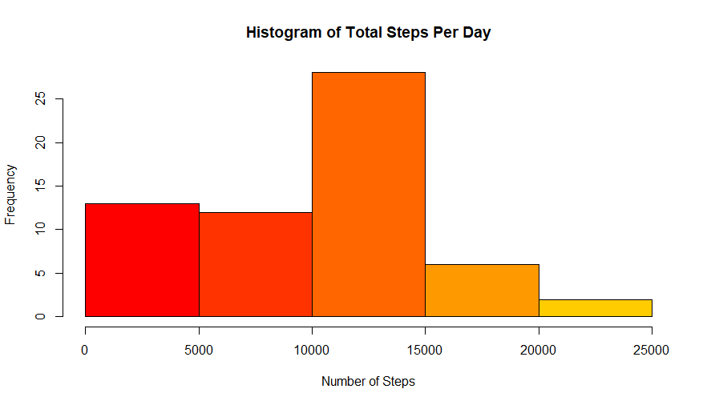
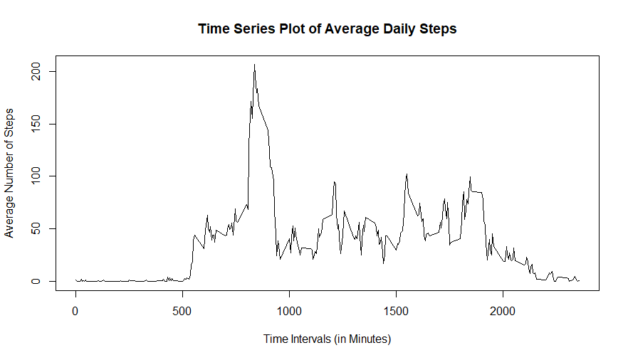
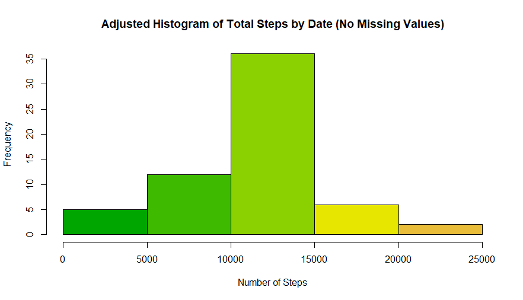
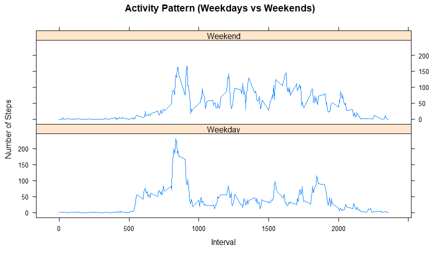

Reproducible Research - Course Project 1
----------------------------------------

This is my submission for this course project. You can see the rest of the submission here. (https://github.com/BoKaplan/RepData_PeerAssessment1)
  
<br>

###Loading and preprocessing the data
```{r, echo=TRUE, message=FALSE, warning=FALSE}
# Import data
act <- read.csv("activity.csv", colClasses = c("numeric", "Date", "numeric"))
```
```{r, echo=TRUE}
# Some variables
str(act)
```

```
## 'data.frame':    17568 obs. of  3 variables:
##  $ steps   : num  NA NA NA NA NA NA NA NA NA NA ...
##  $ date    : Date, format: "2012-10-01" "2012-10-01" ...
##  $ interval: num  0 5 10 15 20 25 30 35 40 45 ...
```

The variables included in this dataset are:  
1. **Steps**: Number of steps taking in a 5-minute interval (missing values are coded as NA)  
2. **Date**: The date on which the measurement was taken in YYYY-MM-DD format  
3. **Interval**: Identifier for the 5-minute interval in which measurement was taken

<br>

###What is mean total number of steps taken per day?

**1. Calculate the total number of steps taken per day**

```{r echo=TRUE}
# Create and print number of steps per day
StepsPerDay <- aggregate(act$steps, list(act$date), FUN=sum)
colnames(StepsPerDay) <- c("Date", "Steps")
StepsPerDay
```

```
##          Date Steps
## 1  2012-10-01    NA
## 2  2012-10-02   126
## 3  2012-10-03 11352
## 4  2012-10-04 12116
## 5  2012-10-05 13294
## 6  2012-10-06 15420
## 7  2012-10-07 11015
## 8  2012-10-08    NA
## 9  2012-10-09 12811
## 10 2012-10-10  9900
## 11 2012-10-11 10304
## 12 2012-10-12 17382
## 13 2012-10-13 12426
## 14 2012-10-14 15098
## 15 2012-10-15 10139
## 16 2012-10-16 15084
## 17 2012-10-17 13452
## 18 2012-10-18 10056
## 19 2012-10-19 11829
## 20 2012-10-20 10395
## 21 2012-10-21  8821
## 22 2012-10-22 13460
## 23 2012-10-23  8918
## 24 2012-10-24  8355
## 25 2012-10-25  2492
## 26 2012-10-26  6778
## 27 2012-10-27 10119
## 28 2012-10-28 11458
## 29 2012-10-29  5018
## 30 2012-10-30  9819
## 31 2012-10-31 15414
## 32 2012-11-01    NA
## 33 2012-11-02 10600
## 34 2012-11-03 10571
## 35 2012-11-04    NA
## 36 2012-11-05 10439
## 37 2012-11-06  8334
## 38 2012-11-07 12883
## 39 2012-11-08  3219
## 40 2012-11-09    NA
## 41 2012-11-10    NA
## 42 2012-11-11 12608
## 43 2012-11-12 10765
## 44 2012-11-13  7336
## 45 2012-11-14    NA
## 46 2012-11-15    41
## 47 2012-11-16  5441
## 48 2012-11-17 14339
## 49 2012-11-18 15110
## 50 2012-11-19  8841
## 51 2012-11-20  4472
## 52 2012-11-21 12787
## 53 2012-11-22 20427
## 54 2012-11-23 21194
## 55 2012-11-24 14478
## 56 2012-11-25 11834
## 57 2012-11-26 11162
## 58 2012-11-27 13646
## 59 2012-11-28 10183
## 60 2012-11-29  7047
## 61 2012-11-30    NA
```


**2. Create histogram**


```{r histogram1, echo=TRUE, fig.width=10, warning=FALSE}
# Drawing the histogram
sum_by_date <- tapply(act$steps,act$date,sum,na.rm=TRUE)
hist(sum_by_date,col=heat.colors(8),xlab="Number of Steps",main="Histogram of Total Steps Per Day")
```

<!-- -->


**3. Figure out what the mean and median are**


```{r echo=TRUE}
# Mean
mean(StepsPerDay$Steps, na.rm = TRUE)
```

```
## [1] 10766.19
```

```{r echo=TRUE}
# Median
median(StepsPerDay$Steps, na.rm = TRUE)
```

```
## [1] 10765
````

<br>

###What is the average daily activity pattern?

**1. Create a time series plot**

```{r timeplot1, echo=TRUE, fig.width=10, warning=FALSE}
# Create a table
StepsPerInterval <- tapply(act$steps,act$interval,mean,na.rm=TRUE)
# Create a line plot
plot(row.names(StepsPerInterval),StepsPerInterval,type="l",xlab="Time Intervals (in Minutes)",ylab="Average Number of Steps",main="Time Series Plot of Average Daily Steps")
```

<!-- -->


**2. Maximum number of steps with 5-minute intervals**

```{r echo=TRUE, fig.width=10, warning=FALSE}
# Interval
maxInterval <- names(sort(StepsPerInterval, decreasing = TRUE)[1])
# Steps
maxSteps <- sort(StepsPerInterval, decreasing = TRUE)[1]
```

```{r echo=TRUE}
# Missing values
x <- max(StepsPerInterval)
match(x,StepsPerInterval)
```

```
## [1] 104
```

```{r echo=TRUE}
StepsPerInterval[104]
```

```
##      835 
## 206.1698
```

<br>

###Imputting missing values

**1. Figure out the missing values**
```{r echo=TRUE}
# Missing values
sum(is.na(act))
```

```
## [1] 2304
```

**2. Adjust dataset**

```{r echo=TRUE}
# Create new dataset
act_na <- act[is.na(act),]
act_no_na <- act[complete.cases(act),]
act_na$steps <- as.numeric(StepsPerInterval)
new_act <- rbind(act_na,act_no_na)
new_act <- new_act[order(new_act[,2],new_act[,3]),]
```

**3. Adjust steps per day**

```{r echo=TRUE}
# Adjust steps
AdjustedStepsPerDay <- aggregate(new_act$steps, list(new_act$date), FUN=sum)
colnames(AdjustedStepsPerDay) <- c("Date", "Steps")
AdjustedStepsPerDay
```

```
##          Date    Steps
## 1  2012-10-01 10766.19
## 2  2012-10-02   126.00
## 3  2012-10-03 11352.00
## 4  2012-10-04 12116.00
## 5  2012-10-05 13294.00
## 6  2012-10-06 15420.00
## 7  2012-10-07 11015.00
## 8  2012-10-08 10766.19
## 9  2012-10-09 12811.00
## 10 2012-10-10  9900.00
## 11 2012-10-11 10304.00
## 12 2012-10-12 17382.00
## 13 2012-10-13 12426.00
## 14 2012-10-14 15098.00
## 15 2012-10-15 10139.00
## 16 2012-10-16 15084.00
## 17 2012-10-17 13452.00
## 18 2012-10-18 10056.00
## 19 2012-10-19 11829.00
## 20 2012-10-20 10395.00
## 21 2012-10-21  8821.00
## 22 2012-10-22 13460.00
## 23 2012-10-23  8918.00
## 24 2012-10-24  8355.00
## 25 2012-10-25  2492.00
## 26 2012-10-26  6778.00
## 27 2012-10-27 10119.00
## 28 2012-10-28 11458.00
## 29 2012-10-29  5018.00
## 30 2012-10-30  9819.00
## 31 2012-10-31 15414.00
## 32 2012-11-01 10766.19
## 33 2012-11-02 10600.00
## 34 2012-11-03 10571.00
## 35 2012-11-04 10766.19
## 36 2012-11-05 10439.00
## 37 2012-11-06  8334.00
## 38 2012-11-07 12883.00
## 39 2012-11-08  3219.00
## 40 2012-11-09 10766.19
## 41 2012-11-10 10766.19
## 42 2012-11-11 12608.00
## 43 2012-11-12 10765.00
## 44 2012-11-13  7336.00
## 45 2012-11-14 10766.19
## 46 2012-11-15    41.00
## 47 2012-11-16  5441.00
## 48 2012-11-17 14339.00
## 49 2012-11-18 15110.00
## 50 2012-11-19  8841.00
## 51 2012-11-20  4472.00
## 52 2012-11-21 12787.00
## 53 2012-11-22 20427.00
## 54 2012-11-23 21194.00
## 55 2012-11-24 14478.00
## 56 2012-11-25 11834.00
## 57 2012-11-26 11162.00
## 58 2012-11-27 13646.00
## 59 2012-11-28 10183.00
## 60 2012-11-29  7047.00
## 61 2012-11-30 10766.19
````

**4. Create adjusted histogram**

```{r histogram2, echo=TRUE, fig.width=10, warning=FALSE}
# Drawing the histogram
new_sum_by_date <- tapply(new_act$steps,new_act$date,sum)
hist(new_sum_by_date,col=terrain.colors(8),xlab="Total Steps by Date",main="Adjusted Histogram of Total Steps by Date (No Missing Values)")
```

<!-- -->


**5. Figure out the adjusted mean and median**

```{r echo=TRUE}
# Mean
mean(AdjustedStepsPerDay$Steps, na.rm = TRUE)
```

```
## [1] 10766.19
````

```{r echo=TRUE}
# Median
median(AdjustedStepsPerDay$Steps, na.rm = TRUE)
```

```
## [1] 10766.19
```
<br>

###Are there differences in activity patterns between weekdays and weekends?


**1. Create a new factor variable in the dataset with two levels**

```{r echo=TRUE}
# Creating a new dataset
is_weekday <- function(d) {
  wd <- weekdays(d)
  ifelse (wd == "Saturday" | wd == "Sunday", "Weekend", "Weekday")
}

wx <- sapply(new_act$date, is_weekday)
new_act$wk <- as.factor(wx)
head(new_act)
```

```
##       steps       date interval      wk
## 1 1.7169811 2012-10-01        0 Weekday
## 2 0.3396226 2012-10-01        5 Weekday
## 3 0.1320755 2012-10-01       10 Weekday
## 4 0.1509434 2012-10-01       15 Weekday
## 5 0.0754717 2012-10-01       20 Weekday
## 6 2.0943396 2012-10-01       25 Weekday
````

**2. Create two time series plot for the average number of steps during weekdays and weekends**

```{r timeplot2, echo=TRUE, fig.width=10, warning=FALSE}
# Create table
wdwx_act <- aggregate(steps ~ wk+interval, data=new_act, FUN=mean)
# Create a line plot
library(lattice)
xyplot(steps ~ interval | factor(wk),
       layout = c(1, 2),
       xlab="Interval",
       ylab="Number of Steps",
       main="Activity Pattern (Weekdays vs Weekends)",
       type="l",
       lty=1,
       data=wdwx_act)
```

<!-- -->
